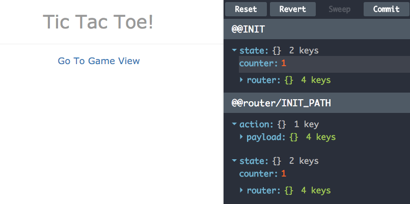

# Tic Tac Starter

[](https://greenkeeper.io/)

Tic Tac Toe built from the [react-redux-starter-kit](https://github.com/davezuko/react-redux-starter-kit).

Once we've downloaded the starter kit, the first thing we'll do is restore our ESLint settings so that we can copy code across from our previous [Tic Tac Toe version](https://github.com/chasm/tic-tac-pack):

```sh
npm i -D eslint-config-rackt
```

Then we can update the `.eslintrc` file, replacing it with:

```
{
  "parser"  : "babel-eslint",

  "extends" : [
    "standard",
    "standard-react"
  ],

  "ecmaFeatures": {
    "globalReturn": true,
    "jsx": true,
    "modules": true
  },

  "env"     : {
    "browser" : true,
    "es6": true,
    "node": true
  },

  "globals" : {
    "__DEV__"      : false,
    "__PROD__"     : false,
    "__DEBUG__"    : false,
    "__DEBUG_NEW_WINDOW__" : false
  },

  "plugins": [
    "react"
  ],

  "extends": "rackt",

  "rules": {
    "react/jsx-uses-react": 1,
    "react/jsx-no-undef": 2,
    "jsx-quotes": [2, "prefer-double"],
    "comma-dangle": [2, "always-multiline"],
    "space-before-function-paren": [1, "always"]
  }
}
```

Next, we'll want to copy in the relevant files from our previous version. We can begin by copying our `game.jsx` and `square.jsx` files into the `src/components` folder. We'll rename them using PascalCase (also called UpperCamelCase or BumpyCase) to keep consistent with the starter kit's conventions. And we can delete the `.gitkeep` file. We must also update the import of Square in the `Game.jsx` file to use the new case.

We're going to need a `src/utils` folder as well, with a `board.js` file in it. We can copy the contents straight across, but we also need to install Ramda, so:

```sh
npm i -D ramda
```

Here is our new Game file:

```jsx
// src/components/Game.jsx
import React, { PropTypes } from 'react'
import { addIndex, flatten, contains, isEmpty, map } from 'ramda'
import { getBoard, checkForWin } from '../utils/board.js'

import Square from './Square'

const mapIndexed = addIndex(map)

const Game = ({}, { store }) => {
  const history = store.getState()[0]
  const board = getBoard(history)
  const wins = flatten(checkForWin(board))

  const renderBoard = (board, wins) => {
    return mapIndexed((player, idx) => {
      const props = { key: idx, square: idx }

      if (contains(idx, wins)) { props.win = true    }
      if (player)              { props.mark = player }

      return <Square {...props} />
    }, board)
  }

  return <div style={{ textAlign: 'center' }}>
    <div className={isEmpty(wins) ? 'board' : 'board won'}>
      {renderBoard(board, wins)}
    </div>
    <button
      onClick={() => store.dispatch({ type: 'NEW_GAME' })}>
      New Game
    </button>
    <button
      onClick={() => store.dispatch({ type: 'UNDO_MOVE' })}>
      Undo Move
    </button>
  </div>
}

Game.contextTypes = {
  store: PropTypes.object,
}

export default Game
```

Here's our Square:

```jsx
// src/components/Square.jsx
import React, { PropTypes } from 'react'

const Square = ({ square, mark, win }, { store }) => {

  const handleClick = () => {
    store.dispatch({
      type: 'MOVE',
      square: square,
    })
  }

  return mark ?
    <div className={win ? `${mark} win` : mark}>{mark}</div> :
    <div onClick={handleClick}/>
}

Square.propTypes = {
  square: PropTypes.number.isRequired,
  mark: PropTypes.string,
  win: PropTypes.bool,
}

Square.defaultProps = {
  win: false,
}

Square.contextTypes = {
  store: PropTypes.object,
}

export default Square
```

And here's our `board.js` utility:

```js
// src/utils/board.js
import { filter, indexOf, reduce, repeat } from 'ramda'

const winPatterns = [
  [ 0, 1, 2 ],
  [ 3, 4, 5 ],
  [ 6, 7, 8 ],
  [ 0, 3, 6 ],
  [ 1, 4, 7 ],
  [ 2, 5, 8 ],
  [ 0, 4, 8 ],
  [ 2, 4, 6 ],
]

const getPlayer = (move, history) => {
  return (indexOf(move, history) % 2 === 0) ? 'x' : 'o'
}

const move = (history) => {
  return (memo, move) => {
    const player = getPlayer(move, history)

    return [
      ...memo.slice(0, move),
      player,
      ...memo.slice(move + 1),
    ]
  }
}

const getBoard = (history) => {
  const memo = repeat(false, 9)

  return reduce(move(history), memo, history)
}

const checkForWin = (board) => {
  return filter((pattern) => {
    const s1 = board[pattern[0]]
    const s2 = board[pattern[1]]
    const s3 = board[pattern[2]]

    return s1 && s1 === s2 && s2 === s3
  }, winPatterns)
}

export default {
  getBoard,
  checkForWin,
}
```

We need to pull across the old CSS file, bring in the former game.css file, and combine it with the starter kit's CSS. We'll figure out the details later. Here is the new `core.scss` file:

```scss
/* src/styles/core.scss
@import 'base';
@import 'vendor/normalize';

// Some best-practice CSS that's useful for most apps
// Just remove them if they're not what you want
html {
  box-sizing: border-box;
}

html,
body {
  background-color: white;
  color: hsla(0, 0%, 60%, 1);
  font-family: Verdana, sans-serif;
  font-size: 18px;
  height: 100%;
  margin: 0;
  padding: 0;
}

*,
*:before,
*:after {
  box-sizing: inherit;
}

.board {
  box-sizing: content-box;
  height: 30rem;
  margin: 5rem auto;
  width: 30rem;
}

.board > div {
  border: 1px solid hsla(240, 50%, 90%, 1);
  box-sizing: border-box;
  float: left;
  font-size: 9rem;
  font-weight: bold;
  height: 10rem;
  line-height: 9rem;
  padding: 0;
  margin: 0;
  text-align: center;
  text-transform: uppercase;
  width: 10rem;
}

.board.won > div.x,
.board.won > div.o {
  color: hsla(0, 0%, 90%, 1)
}

.board > div.x,
.board.won > div.x.win {
  color: hsla(0, 80%, 50%, 1);
}

.board > div.o,
.board.won > div.o.win  {
  color: hsla(120, 80%, 50%, 1);
}

.board > div:nth-child(1),
.board > div:nth-child(2),
.board > div:nth-child(3) {
  border-top-color: white;
}

.board > div:nth-child(3),
.board > div:nth-child(6),
.board > div:nth-child(9) {
  border-right-color: white;
}

.board > div:nth-child(7),
.board > div:nth-child(8),
.board > div:nth-child(9) {
  border-bottom-color: white;
}

.board > div:nth-child(1),
.board > div:nth-child(4),
.board > div:nth-child(7) {
  border-left-color: white;
}

button {
  background-color: #d9534f;
  border: 1px solid rgba(0, 0, 0, 0);
  border-color: #d9534f;
  border-radius: 4px;
  color: #ffffff;
  cursor: pointer;
  display: inline-block;
  font-size: 14px;
  font-weight: 400;
  line-height: 1.4;
  margin: 5px;
  padding: 6px 12px;
  text-align: center;
  vertical-align: middle;
  white-space: nowrap;
}

button:hover {
  background-color: #c9302c;
  border-color: #ac2925;
}
```

Now we'll work our way down from the top, making changes as necessary. We'll begin with the `index.html` file, where we'll fix the `<title>` element:

```html
<!-- src/index.html -->
<!DOCTYPE html>
<html lang="en">
  <head>
    <title>Tic Tac Toe!</title>
    <meta charset="utf-8">
    <meta name="viewport" content="width=device-width, initial-scale=1">
    <link rel="stylesheet" href="https://maxcdn.bootstrapcdn.com/bootstrap/3.3.6/css/bootstrap.min.css">
  </head>
  <body>
    <div id="root" style="height: 100%"></div>
  </body>
</html>
```

A quick look at `src/app.js` shows that it's fine. No changes needed. But we'll need a GameView and we'll need to update our routes. We're not going to use the About page, so let's just adapt that. We'll rename the file from `AboutView.js` to `GameView.js`, and we'll change the code to this:

```jsx
import React from 'react'
import { Link } from 'react-router'

export class GameView extends React.Component {
  render () {
    return (
      <div className="container text-center">
        <div>Game goes here</div>
        <hr />
        <Link to="/">Back To Home View</Link>
      </div>
    )
  }
}

export default GameView
```

And we'll need to update our HomeView accordingly:

```jsx
import React from 'react'
import { connect } from 'react-redux'
import { Link } from 'react-router'
import { actions as counterActions } from '../redux/modules/counter'
import styles from './HomeView.scss'

const mapStateToProps = (state) => ({
  counter: state.counter,
})

export class HomeView extends React.Component {
  static propTypes = {
    counter: React.PropTypes.number.isRequired,
    doubleAsync: React.PropTypes.func.isRequired,
    increment: React.PropTypes.func.isRequired,
  }

  render () {
    return (
      <div className="container text-center">
        <h1>Tic Tac Toe!</h1>
        <hr />
        <Link to="/games">Go To Game View</Link>
      </div>
    )
  }
}

export default connect(mapStateToProps, counterActions)(HomeView)
```

And, of course, we'll need to update the `routes` as well:

```js
// src/routes/index.js
import React from 'react'
import { Route, IndexRoute } from 'react-router'
import CoreLayout from 'layouts/CoreLayout'
import HomeView from 'views/HomeView'
import GameView from 'views/GameView'

export default (
  <Route path="/" component={CoreLayout}>
    <IndexRoute component={HomeView} />
    <Route path="/games" component={GameView} />
  </Route>
)
```

Now we can start the app and see if it works:

```sh
npm start
```

We should see something like this:



If we click on the link to the Games page, we will see "Game goes here". Not really as exciting as we'd hoped. Better implement the game logic.

The starter kit assumes an approach to organizing our application in which we have the following breakdown:

- Layouts: code that describes an entire page structure, such as a fixed navigation, viewport, sidebar, and footer.
- Views: components that live at routes, and are generally rendered within a Layout.
- Containers: components that provide context (e.g. Redux Provider).
- Components: nearly everything inside of Components ends up being a dumb component.

If we follow the code from the top down, we see that in `src/app.js` we import the Root component from `src/containers/Root.js`. So let's look at `Root.js`.

We pass in three props, those being:

- `history`, which we get by calling the `createBrowserHistory()` function, which is imported from the `history` module.
- `routes`, which we import from our `routes` folder, and which we already updated above.
- `store`, which uses `configureStore` imported from our `redux` folder, and is called on this line:
  ```js
  const store = configureStore(window.__INITIAL_STATE__)
  ```

So we'll need to track down this `__INITIAL_STATE__` variable. And a global search reveals that it is nowhere to be found. So what is this __INITIAL_STATE__?

This is actually the current state of the Redux store *as passed from the server*. We can persist our state on the server, and pass it by rendering it to a `<script>` element on the page stringified and assigned to __INITIAL_STATE__. We haven't done that yet, so __INITIAL_STATE__ is undefined.

But because of the way Redux sets up the store, that's no problem. The store has a built-in default state, so it will simply begin with that. So let's go look at this `src/redux/configureStore` file.

Let's follow the code. The `configureStore` file contains this interesting conditional:

```js
// in src/redux/configureStore.js
if (__DEBUG__) {
  createStoreWithMiddleware = compose(
    middleware,
    require('containers/DevTools').instrument()
  )
} else {
  createStoreWithMiddleware = compose(middleware)
}
```

All this does, really, is add in our DevTools component&mdash;that side panel we see in the home page view above&mdash;when we're in DEBUG mode. So let's not worry about that.

Then there's this:

```js
// in src/redux/configureStore.js
const store = createStoreWithMiddleware(createStore)(
  rootReducer, initialState
)
```

The initial state is passed in above that to the `configureStore` method itself, and that, as we saw previously, comes from the __INITIAL_STATE__ window variable which comes from the server. So we see where that's going to come from. For now, it's undefined, so we can forget about it. So what we need to know is, What is this `rootReducer`? It is imported at the top of the file:

```js
// in src/redux/configureStore.js
import rootReducer from './modules'
```

So let's go to the `src/redux/modules/index.js` file and see what we have:

```js
// src/redux/modules/index.js
import { combineReducers } from 'redux'
import { routeReducer } from 'redux-simple-router'
import counter from './counter'

export default combineReducers({
  counter,
  router: routeReducer
})
```

Excellent! So all the rootReducer does is combine our `counter` reducer with the `routeReducer`. We can leave the route reducer alone as it's working just fine. What is this `counter` reducer? Oh, it's the example reducer that comes with the starter kit. So let's just rework it for our needs. We'll rename it to `game`:

```js
// src/redux/modules/index.js
import { combineReducers } from 'redux'
import { routeReducer } from 'redux-simple-router'
import game from './game'

export default combineReducers({
  game,
  router: routeReducer,
})
```

Then we'll rename the `counter.js` file to `game.js` and we'll copy in our game reducer code from our previous version of Tic Tac Toe. At the top of the `counter.js` file we find a section for actions:

```js
// in src/redux/modules/counter.js
export const COUNTER_INCREMENT = 'COUNTER_INCREMENT'
```

We'll change that to our actions (we'll start with a single game):

```js
// in src/redux/modules/game.js
export const MOVE = 'MOVE'
export const UNDO_MOVE = 'UNDO_MOVE'
```

Simple, no?

Then we see the current counter actions:

```js
// in src/redux/modules/counter.js
export const increment = createAction(COUNTER_INCREMENT, (value = 1) => value)
```

So we'll replace the counter action with our actions:

```js
// src/redux/modules/game.js
export const move = createAction(MOVE, square => square)
export const undoMove = createAction(UNDO_MOVE)

export const actions = {
  move,
  undoMove,
}
```

Finally, we notice that something weird is going on with this call to `handleActions`:

```js
// in src/redux/modules/counter.js
export default handleActions({
  [COUNTER_INCREMENT]: (state, { payload }) => state + payload,
}, 1)
```

These `createAction` and `handleActions` functions are being imported from [`redux-actions`](https://github.com/acdlite/redux-actions). If we look up that module, we see that its intent is to *standardize* Redux actions. Each action will include a `type` and a `payload`.

Not sure why the starter kit developer put the COUNTER_INCREMENT in an array. It doesn't seem to need one.

You can see from our Action above that the move simply passes the number of the square through. We want to append that to our game array, so we'll use the spread operator and the "payload" (the square) to create a new array with our move at the end and we'll return that. For the undoMove action, all we need to do is return the game array with the last move sliced off it (ouch!).

We'll update the `handleActions` thus:

```js
// src/redux/modules/game.js
export default handleActions({
  MOVE: (state, { payload }) => [ ...state, payload ],
  UNDO_MOVE: (state) => [ ...state.slice(0, state.length - 1) ],
}, [])
```

Are store and reducers and actions should now be set. How do we pass these down to our Game and Square components? Previously, we were using the context, but here we'll do it a bit differently using a container.

If we look at the `src/app.js` file at the top of our tree, we'll see that it imports and uses the Root container:

```jsx
// in src/app.js
import Root from './containers/Root'

// more code . . .

ReactDOM.render(
  <Root history={history} routes={routes} store={store} />,
  document.getElementById('root')
)
```

We'll follow this back. In the `src/containers/Root.js` file we'll see that there is a getter that uses the Router and the history and routs (passed in as props) to create a new router and make it available as `this.content`.

```jsx
// in src/containers/Root.js
get content () {
  return (
    <Router history={this.props.history}>
      {this.props.routes}
    </Router>
  )
}
```

Then below that it wraps the Router in a Provider and passes in the `store`:

```jsx
// in src/containers/Root.js
render () {
  return (
    <Provider store={this.props.store}>
      <div style={{ height: '100%' }}>
        {this.content}
        {this.devTools}
      </div>
    </Provider>
  )
}
```

So we know that the state is available in the individual routes. The routes, as you may recall, look like this:

```jsx
// in src/routes/index.js
<Route path="/" component={CoreLayout}>
  <IndexRoute component={HomeView} />
  <Route path="/games" component={GameView} />
</Route>
```

So we should have the store available in our GameView (and the HomeView as well). In the GameView, we're going to use `connect` from [`react-redux`](https://github.com/rackt/react-redux/blob/master/docs/api.md#connectmapstatetoprops-mapdispatchtoprops-mergeprops-options).

The `connect` function has the following signature:

```js
connect([mapStateToProps], [mapDispatchToProps], [mergeProps], [options])
```

Here is the example we want to use (from the documentation&mdash;not part of our application):

```js
import * as actionCreators from './actionCreators'

function mapStateToProps(state) {
  return { todos: state.todos }
}

export default connect(mapStateToProps, actionCreators)(TodoApp)
```

So we need to map our state to the props, and then pass in our action creators. Here's how we do it:

```jsx
// src/views/GameView.js
import React from 'react'
import { connect } from 'react-redux'
import { Link } from 'react-router'
import { actions as gameActions } from '../redux/modules/game'

import Game from '../components/Game'

const mapStateToProps = (state) => ({
  game: state.game,
})

export class GameView extends React.Component {
  static propTypes = {
    game: React.PropTypes.array.isRequired,
    move: React.PropTypes.func.isRequired,
    undoMove: React.PropTypes.func.isRequired,
  }

  render () {
    return (
      <div className="container text-center">
        <Game {...this.props} />
        <hr />
        <Link to="/">Back To Home View</Link>
      </div>
    )
  }
}

export default connect(mapStateToProps, gameActions)(GameView)
```

So we import our `actions` from `src/redux/modules/game` as `gameActions`, then we pass them in our `connect` call.

We also map our state to a prop:

```js
in src/views/GameView.js
const mapStateToProps = (state) => ({
  game: state.game,
})
```

What this means is that our GameView is going to get both the `game` state and the `move` and `undoMove` actions as props. And it can then use the spread operator to pass these on to the Game itself.

Now in our `Game.js` file, our `game` prop is simply the array of moves (what we'd called `history` previously). So we can just pass it to the `getBoard` function:

```jsx
// in src/components/Game.js
const Game = ({ game, move, undoMove }) => {
  const board = getBoard(game)
  const wins = flatten(checkForWin(board))
```

We also add our `move` action to our Square props:

```jsx
// in src/components/Game.js
const props = { key: idx, square: idx, move: move }
```

And we set our Undo button to use the `undoMove` method:

```jsx
// in src/components/Game.js
<button
  onClick={undoMove}>
  Undo Move
</button>
```

The result is simple and clean, though it might take a little getting used to:

```jsx
// src/components/Game.jsx
import React, { PropTypes } from 'react'
import { addIndex, flatten, contains, isEmpty, map } from 'ramda'
import { getBoard, checkForWin } from '../utils/board.js'

import Square from './Square'

const mapIndexed = addIndex(map)

const Game = ({ game, move, undoMove }) => {
  const board = getBoard(game)
  const wins = flatten(checkForWin(board))

  const renderBoard = (board, wins) => {
    return mapIndexed((player, idx) => {
      const props = { key: idx, square: idx, move: move }

      if (contains(idx, wins)) { props.win = true    }
      if (player)              { props.mark = player }

      return <Square {...props} />
    }, board)
  }

  return <div style={{ textAlign: 'center' }}>
    <section className={isEmpty(wins) ? 'board' : 'board won'}>
      {renderBoard(board, wins)}
    </section>
    <button
      onClick={undoMove}>
      Undo Move
    </button>
  </div>
}

Game.contextTypes = {
  store: PropTypes.object,
}

export default Game
```

The square needs little modification:

```jsx
// src/components/Square.js
import React, { PropTypes } from 'react'

const Square = ({ square, mark, win, move }) => {
  return mark ?
    <div className={win ? `${mark} win` : mark}>{mark}</div> :
    <div onClick={() => move(square)} />
}

Square.propTypes = {
  square: PropTypes.number.isRequired,
  mark: PropTypes.string,
  win: PropTypes.bool,
}

Square.defaultProps = {
  win: false,
}

Square.contextTypes = {
  store: PropTypes.object,
}

export default Square
```
